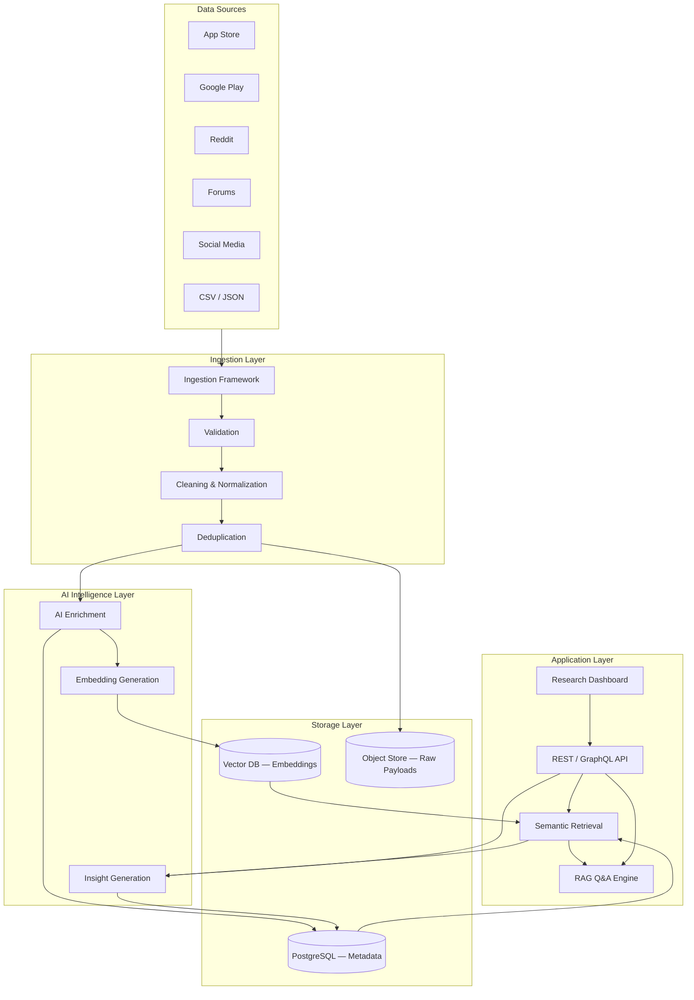
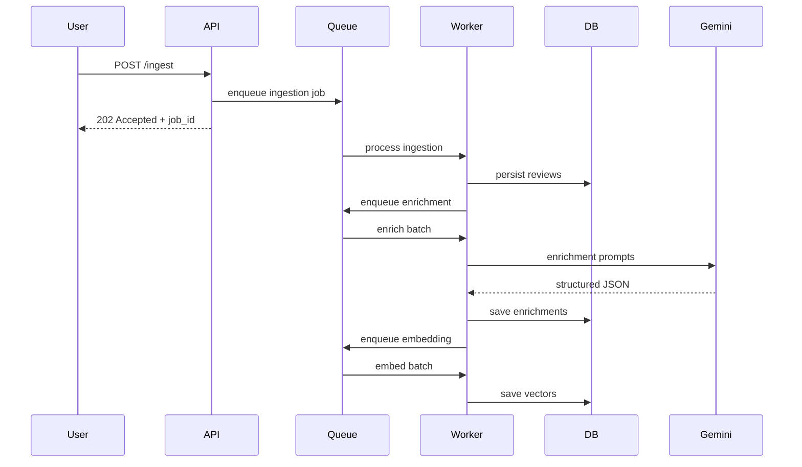
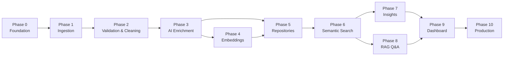

# AI-Powered Review Discovery Engine — Architecture

## Document Purpose

This document defines the **system architecture** for the AI-Powered Review Discovery Engine described in `ProblemStatement.md`. It is organized as a **phase-by-phase build model** so each module can be implemented independently, tested in isolation, and integrated incrementally without rewriting earlier work.

The system is an **AI Product Research Assistant** — not a music app, recommendation engine, or analytics dashboard. Every architectural decision serves one goal: transform unstructured user feedback into structured, searchable, evidence-backed product intelligence.

---

## High-Level System Overview

The platform consists of five logical layers that communicate through well-defined interfaces:



### Core Data Flow

1. **Ingest** raw reviews from heterogeneous sources.
2. **Normalize** into a unified review schema without mutating originals.
3. **Enrich** each review with AI-generated structured metadata.
4. **Embed** review text for semantic similarity search.
5. **Store** raw text, enrichment, and vectors in separate stores.
6. **Retrieve** relevant evidence via semantic search.
7. **Generate** aggregate insights and RAG answers grounded in retrieved reviews.
8. **Present** findings through a research-oriented dashboard.

---

## Architectural Principles

| Principle | Implementation |
|-----------|----------------|
| Separation of concerns | Each pipeline stage is an independent module with a single responsibility |
| Non-destructive processing | Raw reviews are immutable; enrichment lives in separate tables/documents |
| Pluggable ingestion | New sources implement a common `SourceAdapter` interface |
| Config-driven behavior | API keys, model names, batch sizes, and source configs live in environment/config files |
| Evidence-first answers | Every insight and Q&A response links to source review IDs and excerpts |
| Incremental delivery | Phases produce a working vertical slice before adding the next capability |
| Testability | Each module exposes pure functions or services testable without the full stack |

---

## Technology Stack (Recommended)

These choices balance developer velocity, production readiness, and the requirements in the problem statement. Adjust per team preference; the **module boundaries** matter more than specific libraries.

| Layer | Technology | Rationale |
|-------|------------|-----------|
| Backend API | **Python 3.11+ / FastAPI** | Strong AI/ML ecosystem, async I/O, OpenAPI docs |
| Task queue | **Celery + Redis** (or **RQ**) | Decouple long-running ingestion and enrichment jobs |
| Relational DB | **PostgreSQL** | Structured metadata, aggregations, time-series queries |
| Vector store | **pgvector** (start) → **Qdrant** or **Pinecone** (scale) | Semantic search with minimal ops overhead initially |
| Object storage | **Local filesystem** (dev) → **S3-compatible** (prod) | Preserve original payloads and export artifacts |
| LLM provider | **Google Gemini** (`gemini-2.0-flash` enrichment, `gemini-2.5-pro` RAG) | Enrichment, summarization, RAG generation |
| Embeddings | **Google `text-embedding-004`** or **`gemini-embedding-001`** | Same provider as LLM; cost-effective semantic retrieval |
| AI SDK | **`google-genai`** (Python) | Official Google Gen AI SDK for Gemini text + embedding APIs |
| Frontend | **React + TypeScript + Tailwind** | Component-rich research UI |
| Orchestration | **Docker Compose** (dev) | Reproducible local environment |

### Google Gemini Integration

All AI capabilities use **Google Gemini** exclusively — no OpenAI or Anthropic dependencies.

| Use case | Model | Notes |
|----------|-------|-------|
| Review enrichment (batch) | `gemini-2.0-flash` | Fast, low-cost; structured JSON via `response_mime_type: application/json` |
| RAG answer generation | `gemini-2.5-pro` | Higher reasoning quality for research Q&A |
| Insight synthesis (JTBD, themes) | `gemini-2.0-flash` | Batch aggregation prompts |
| Query embedding | `text-embedding-004` | 768 dimensions; set `VECTOR_DIMENSION=768` |
| Review embedding | `text-embedding-004` | Same model for index/query parity |

Implementation conventions:
- Wrap Gemini calls in `src/ai/gemini_client.py` — single entry point for generate + embed
- Enrichment uses Gemini **JSON mode** with Pydantic schema validation on the response
- Rate limiting respects [Gemini API quotas](https://ai.google.dev/gemini-api/docs/rate-limits); batch with configurable concurrency
- API key stored as `GOOGLE_API_KEY` (Google AI Studio) or service-account credentials for Vertex AI (future)

---

## Unified Review Schema

All sources converge on a canonical `Review` model. Source-specific fields are preserved in a `source_metadata` JSON blob.

```json
{
  "id": "uuid",
  "source": "app_store | google_play | reddit | forum | social | csv | json",
  "source_id": "platform-native identifier",
  "source_url": "optional permalink",
  "app_name": "Spotify",
  "platform": "ios | android | web | unknown",
  "author_hash": "pseudonymized author id",
  "rating": 1-5 or null,
  "title": "optional",
  "body": "raw review text — never modified",
  "language": "en",
  "review_date": "ISO-8601",
  "ingested_at": "ISO-8601",
  "content_hash": "sha256 for deduplication",
  "source_metadata": {}
}
```

**Enrichment** (stored separately as `ReviewEnrichment`):

```json
{
  "review_id": "uuid",
  "sentiment": "positive | negative | neutral | mixed",
  "emotion": ["frustration", "delight"],
  "primary_topic": "discovery",
  "user_goal": "find new music",
  "pain_point": "repetitive recommendations",
  "feature_request": "better genre filters",
  "discovery_issue": "Discover Weekly feels stale",
  "listening_behavior": "repeat listening",
  "user_segment": "casual listener",
  "keywords": ["discover weekly", "repetitive"],
  "summary": "one-sentence AI summary",
  "confidence_score": 0.87,
  "model_version": "enrichment-v1",
  "enriched_at": "ISO-8601"
}
```

---

## Project Folder Structure

```
spotify-review-analyser/
├── config/
│   ├── settings.py              # Pydantic settings from env
│   └── sources.yaml             # Per-source ingestion config
├── src/
│   ├── ai/
│   │   └── gemini_client.py     # Unified Gemini generate + embed wrapper
│   ├── ingestion/
│   │   ├── base.py              # SourceAdapter ABC
│   │   ├── registry.py          # Source registration
│   │   └── adapters/            # app_store, google_play, reddit, csv, ...
│   ├── pipeline/
│   │   ├── validator.py
│   │   ├── cleaner.py
│   │   ├── normalizer.py
│   │   └── deduplicator.py
│   ├── enrichment/
│   │   ├── prompts/
│   │   ├── enricher.py
│   │   └── schemas.py           # Pydantic output models
│   ├── embeddings/
│   │   ├── embedder.py
│   │   └── chunker.py           # Optional long-review chunking
│   ├── storage/
│   │   ├── models/                # SQLAlchemy / ORM models
│   │   ├── repositories/
│   │   └── vector_store.py
│   ├── retrieval/
│   │   ├── semantic_search.py
│   │   └── ranker.py
│   ├── insights/
│   │   ├── theme_detector.py
│   │   ├── aggregator.py
│   │   └── trend_analyzer.py
│   ├── rag/
│   │   ├── retriever.py
│   │   ├── prompt_builder.py
│   │   └── answer_generator.py
│   ├── api/
│   │   ├── main.py
│   │   ├── routes/
│   │   └── dependencies.py
│   └── workers/
│       ├── tasks.py               # Celery task definitions
│       └── schedules.py
├── frontend/
│   └── src/
│       ├── pages/
│       ├── components/
│       └── services/api.ts
├── tests/
│   ├── unit/
│   └── integration/
├── scripts/
│   ├── seed_sample_data.py
│   └── run_pipeline.py
├── docker-compose.yml
├── .env.example
├── requirements.txt
└── README.md
```

---

## Phase-by-Phase Build Model

Each phase lists: **objective**, **dependencies**, **deliverables**, **key files**, **exit criteria**, and **how it connects** to the next phase.

---

### Phase 0 — Foundation & Infrastructure

**Objective:** Establish the project skeleton, configuration system, database connections, and development environment so all later phases plug into a stable base.

**Dependencies:** None.

**Deliverables:**
- Repository initialized with folder structure above
- `config/settings.py` — environment-based configuration (DB URL, `GOOGLE_API_KEY`, Gemini model names)
- `requirements.txt` including `google-genai` SDK
- Docker Compose with PostgreSQL (+ pgvector extension), Redis
- SQLAlchemy/Alembic setup with initial migration for `reviews` and `review_enrichments` tables
- FastAPI app stub with `/health` endpoint
- Logging, error handling conventions documented in code

**Key files:**
- `config/settings.py`
- `src/storage/models/review.py`
- `src/api/main.py`
- `docker-compose.yml`
- `.env.example`

**Exit criteria:**
- `docker compose up` starts Postgres and API
- `/health` returns 200
- Migrations run cleanly on empty database

**Connects to Phase 1:** Storage models and config are ready to persist ingested reviews.

---

### Phase 1 — Data Ingestion Framework

**Objective:** Build a modular, extensible ingestion layer that pulls reviews from multiple sources and writes them to the unified schema.

**Dependencies:** Phase 0.

**Deliverables:**
- `SourceAdapter` abstract base class defining: `fetch()`, `parse()`, `validate_raw()`
- Adapter registry for dynamic source registration
- Initial adapters (implement in order of simplicity):
  1. **CSV adapter** — bootstrap with sample datasets
  2. **JSON adapter** — bulk import
  3. **App Store / Google Play** — API or scraper (configurable)
  4. **Reddit adapter** — PRAW or API-based
- Ingestion orchestrator: `IngestionService.run(source_name, options)`
- CLI script: `python scripts/run_pipeline.py ingest --source csv --file reviews.csv`
- Raw payload archival to object store (optional in Phase 1, required before prod)

**Key files:**
- `src/ingestion/base.py`
- `src/ingestion/registry.py`
- `src/ingestion/adapters/csv_adapter.py`
- `src/ingestion/adapters/json_adapter.py`
- `src/ingestion/service.py`

**Exit criteria:**
- CSV/JSON files ingest into `reviews` table with correct schema
- Adding a new adapter requires only implementing `SourceAdapter` + registry entry
- Ingestion is idempotent on `source + source_id`

**Connects to Phase 2:** Raw reviews flow into validation and cleaning pipeline.

---

### Phase 2 — Validation, Cleaning, Normalization & Deduplication

**Objective:** Ensure every ingested review is clean, consistent, and unique before AI processing.

**Dependencies:** Phase 1.

**Deliverables:**

| Module | Responsibility |
|--------|----------------|
| `validator.py` | Required fields, rating bounds, date parsing, text length limits |
| `cleaner.py` | Strip HTML, normalize whitespace, detect empty/spam reviews |
| `normalizer.py` | Map source-specific fields → unified schema; language detection |
| `deduplicator.py` | Hash-based dedup on normalized body; near-duplicate detection (optional fuzzy match) |

- Pipeline orchestrator chaining: `validate → clean → normalize → deduplicate → persist`
- Rejected reviews logged to `ingestion_errors` table with reason codes
- Unit tests with edge cases (empty body, duplicate hash, malformed dates)

**Key files:**
- `src/pipeline/validator.py`
- `src/pipeline/cleaner.py`
- `src/pipeline/normalizer.py`
- `src/pipeline/deduplicator.py`
- `src/pipeline/orchestrator.py`

**Exit criteria:**
- Invalid reviews are rejected with auditable reasons
- Duplicate reviews are skipped or merged without data loss
- Pipeline processes 1,000+ reviews in batch without manual intervention

**Connects to Phase 3:** Clean, deduplicated reviews enter AI enrichment.

---

### Phase 3 — AI Enrichment Layer

**Objective:** Transform unstructured review text into structured metadata using **Google Gemini**, without modifying the original review body.

**Dependencies:** Phase 2.

**Deliverables:**
- `GeminiClient` wrapper in `src/ai/gemini_client.py` (generate + structured JSON)
- Pydantic schemas for enrichment output; validated against Gemini JSON-mode responses
- Prompt templates in `src/enrichment/prompts/` — versioned and testable
- `EnrichmentService.enrich(review)` — single review enrichment via `gemini-2.0-flash`
- `EnrichmentService.enrich_batch(reviews, concurrency)` — batched async processing
- Celery task: `enrich_reviews_task(review_ids)`
- Retry logic, rate limiting, and cost tracking per batch
- `review_enrichments` table populated with one row per review
- Skip/already-enriched guard using `model_version`

**Enrichment fields (from problem statement):**
sentiment, emotion, primary_topic, user_goal, pain_point, feature_request, discovery_issue, listening_behavior, user_segment, keywords, summary, confidence_score

**Key files:**
- `src/ai/gemini_client.py`
- `src/enrichment/enricher.py`
- `src/enrichment/schemas.py`
- `src/enrichment/prompts/enrichment_v1.txt`
- `src/workers/tasks.py` (enrichment task)

**Exit criteria:**
- 95%+ of valid reviews produce schema-valid enrichment JSON
- Original `reviews.body` is never updated
- Enrichment is re-runnable with new `model_version` without data corruption

**Connects to Phase 4:** Enriched reviews (body + metadata) are ready for embedding.

---

### Phase 4 — Embedding Generation & Vector Storage

**Objective:** Generate vector embeddings for semantic search and persist them in a dedicated vector store.

**Dependencies:** Phase 3.

**Deliverables:**
- `Chunker` — split long reviews (>512 tokens) into overlapping chunks with parent review ID
- `Embedder` — call Gemini embedding API (`text-embedding-004`); cache embeddings by content hash
- `VectorStore` abstraction with pgvector implementation
- `review_embeddings` table: `review_id`, `chunk_index`, `embedding`, `content_hash`, `model_version`
- Batch embedding worker with progress tracking
- Index creation (IVFFlat or HNSW depending on pgvector version)

**Key files:**
- `src/embeddings/chunker.py`
- `src/embeddings/embedder.py`
- `src/storage/vector_store.py`

**Exit criteria:**
- Semantic query returns relevant reviews that keyword search would miss (e.g., "repetitive" ↔ "same songs every day")
- Embedding generation is resumable after interruption
- Vector dimension and model version are tracked per row

**Connects to Phase 5:** Both relational metadata and vectors are queryable.

---

### Phase 5 — Metadata Storage & Repository Layer

**Objective:** Consolidate data access behind repository interfaces so upper layers never touch SQL/vector details directly.

**Dependencies:** Phases 0–4.

**Deliverables:**
- Repository pattern:
  - `ReviewRepository` — CRUD, filters by source/date/rating/segment
  - `EnrichmentRepository` — query by topic, pain_point, sentiment
  - `EmbeddingRepository` — vector similarity search wrapper
- Composite queries: reviews + enrichment joins
- Pagination, sorting, full-text fallback (PostgreSQL `tsvector`) as hybrid search prep
- Database indexes on high-cardinality filter columns

**Key files:**
- `src/storage/repositories/review_repo.py`
- `src/storage/repositories/enrichment_repo.py`
- `src/storage/repositories/embedding_repo.py`

**Exit criteria:**
- API-consumable query methods exist for all dashboard filter combinations
- Query latency < 200ms for filtered metadata queries on 50K reviews (indexed)

**Connects to Phase 6:** Retrieval layer uses repositories exclusively.

---

### Phase 6 — Semantic Search & Retrieval

**Objective:** Enable meaning-based search that returns ranked reviews with relevance scores and highlighted excerpts.

**Dependencies:** Phase 5.

**Deliverables:**
- `SemanticSearchService.search(query, filters, top_k)`:
  1. Embed query text
  2. Vector similarity search in pgvector
  3. Optional metadata pre-filter (date range, source, sentiment, segment)
  4. Re-rank with cross-encoder or Gemini reranker (optional enhancement)
  5. Return `SearchResult` with review, enrichment, score, excerpt
- Hybrid search mode: combine vector score + keyword boost
- Search API endpoint: `POST /api/v1/search`

**Key files:**
- `src/retrieval/semantic_search.py`
- `src/retrieval/ranker.py`
- `src/api/routes/search.py`

**Exit criteria:**
- Natural-language queries return semantically relevant results
- Every result includes `review_id`, excerpt, score, and source link
- Filters correctly narrow results without breaking ranking

**Connects to Phase 7 & 8:** Search powers both insight mining and RAG retrieval.

---

### Phase 7 — Insight Generation

**Objective:** Aggregate enriched reviews into higher-level, evidence-backed product insights.

**Dependencies:** Phases 3, 5, 6.

**Deliverables:**

| Insight type | Method |
|--------------|--------|
| Frequent pain points | Aggregation on `pain_point` + clustering |
| Feature requests | Top-N feature_request counts with example reviews |
| Emerging themes | Time-windowed topic frequency delta |
| User segment analysis | Group-by `user_segment` with sentiment breakdown |
| Platform comparison | Group-by `source` / `platform` |
| JTBD patterns | Gemini synthesis over clustered reviews |
| Trend over time | Weekly/monthly rollups on enrichment fields |

- `InsightService.generate(insight_type, params)` — returns structured insight + evidence review IDs
- Precomputed insight cache table `insights_cache` (refreshed on schedule or after ingestion)
- On-demand insight generation for custom filters
- API endpoints: `GET /api/v1/insights`, `GET /api/v1/insights/{type}`

**Key files:**
- `src/insights/aggregator.py`
- `src/insights/theme_detector.py`
- `src/insights/trend_analyzer.py`
- `src/api/routes/insights.py`

**Exit criteria:**
- Top pain points and feature requests surfaced with ≥3 supporting review excerpts each
- Trend insights show period-over-period change with evidence
- Insights are regenerable without manual SQL

**Connects to Phase 8:** Insights enrich RAG context; dashboard displays them.

---

### Phase 8 — RAG-Based Natural Language Q&A

**Objective:** Answer research questions in plain English with responses grounded in retrieved review evidence.

**Dependencies:** Phases 6, 7.

**Deliverables:**
- RAG pipeline:
  1. **Query understanding** — optional query rewrite/expansion
  2. **Retrieval** — top-K reviews via semantic search (+ metadata filters inferred from question)
  3. **Context assembly** — build prompt with review excerpts, enrichment summaries, and insight snippets
  4. **Generation** — Gemini (`gemini-2.5-pro`) produces answer with citations
  5. **Citation validation** — ensure cited review IDs exist in retrieved set
- Response schema:
  ```json
  {
    "answer": "markdown text",
    "confidence": "high | medium | low",
    "citations": [
      { "review_id": "uuid", "excerpt": "...", "source": "reddit", "relevance_score": 0.91 }
    ],
    "related_insights": ["insight_id_1"],
    "retrieval_count": 15
  }
  ```
- Guardrails: refuse to answer when retrieval confidence is too low; say "insufficient evidence"
- API endpoint: `POST /api/v1/ask`
- Conversation mode (optional): multi-turn with session context

**Key files:**
- `src/rag/retriever.py`
- `src/rag/prompt_builder.py`
- `src/rag/answer_generator.py`
- `src/api/routes/ask.py`

**Exit criteria:**
- Sample questions from problem statement produce evidence-backed answers
- Every factual claim in an answer maps to at least one citation
- System declines gracefully when no relevant reviews exist

**Connects to Phase 9:** Q&A exposed through dashboard chat interface.

---

### Phase 9 — Research Dashboard & API Surface

**Objective:** Deliver a clean, research-oriented UI and complete REST API for all platform capabilities.

**Dependencies:** Phases 6, 7, 8.

**Deliverables:**

**Backend API (complete surface):**

| Endpoint | Purpose |
|----------|---------|
| `POST /api/v1/search` | Semantic search |
| `POST /api/v1/ask` | RAG Q&A |
| `GET /api/v1/insights` | Browse insights |
| `GET /api/v1/reviews/{id}` | Review detail + enrichment |
| `GET /api/v1/topics` | Topic clusters |
| `GET /api/v1/segments` | Segment breakdown |
| `POST /api/v1/export` | CSV/JSON export of findings |
| `POST /api/v1/ingest` | Trigger ingestion (admin) |

**Frontend pages:**

| Page | Features |
|------|----------|
| **Search** | Natural-language search bar, filters, result cards with excerpts |
| **Insights** | Pain points, feature requests, trends — clickable to drill into evidence |
| **Topics** | Cluster visualization, topic → review list |
| **Segments** | Segment comparison charts |
| **Ask** | Chat-style research Q&A with inline citations |
| **Review Detail** | Full review, enrichment fields, link to source |
| **Export** | Select and export findings |

**UX principles (from problem statement):**
- Clarity over visual complexity
- Every insight links to supporting evidence
- Research workflow: question → evidence → export

**Key files:**
- `frontend/src/pages/Search.tsx`
- `frontend/src/pages/Insights.tsx`
- `frontend/src/pages/Ask.tsx`
- `frontend/src/components/EvidencePanel.tsx`
- `frontend/src/components/CitationCard.tsx`

**Exit criteria:**
- End-to-end demo: ingest CSV → search → view insights → ask question → export
- All user-facing features accessible without direct API calls
- Responsive layout usable on desktop (primary target)

**Connects to Phase 10:** Feature-complete MVP ready for hardening.

---

### Phase 10 — Production Hardening, Observability & Scale

**Objective:** Make the system reliable, observable, and ready for larger datasets and additional sources.

**Dependencies:** Phase 9 (MVP complete).

**Deliverables:**
- **Observability:** Structured logging, request tracing, enrichment cost metrics, pipeline job dashboards
- **Error handling:** Dead-letter queue for failed enrichments; automatic retry with exponential backoff
- **Performance:** Batch size tuning, connection pooling, vector index optimization, caching hot insights
- **Security:** API key auth, rate limiting, input sanitization, secrets via env/vault
- **Scale path:** Document migration from pgvector → dedicated vector DB (Qdrant/Pinecone)
- **Additional source adapters:** Forum, social media — plug into existing ingestion framework
- **CI/CD:** Lint, unit tests, integration tests on pipeline, Docker image build
- **Documentation:** API docs (OpenAPI), runbook for ingestion and re-enrichment

**Exit criteria:**
- System processes 100K+ reviews with monitored pipeline throughput
- Failed jobs are recoverable without manual DB edits
- New data source added in < 1 day using adapter pattern

---

## Cross-Cutting Concerns

### Async Processing Model

Long-running work (ingestion batches, enrichment, embedding) runs as **background jobs**, not inline API calls.



### Evidence Contract

Every user-facing generated output MUST satisfy:

1. **Traceability** — links to `review_id`(s)
2. **Verifiability** — excerpt matches stored `reviews.body`
3. **Provenance** — source, date, and platform visible
4. **Honesty** — low-confidence or empty retrieval → explicit "insufficient evidence" response

### Configuration Management

```
.env
├── DATABASE_URL
├── REDIS_URL
├── GOOGLE_API_KEY              # Google AI Studio key for Gemini
├── GEMINI_ENRICHMENT_MODEL     # default: gemini-2.0-flash
├── GEMINI_RAG_MODEL            # default: gemini-2.5-pro
├── GEMINI_EMBEDDING_MODEL      # default: text-embedding-004
├── VECTOR_DIMENSION            # default: 768 (text-embedding-004)
└── LOG_LEVEL
```

Source-specific configs in `config/sources.yaml`:

```yaml
sources:
  csv:
    enabled: true
  app_store:
    enabled: false
    app_id: "324684580"
  reddit:
    enabled: true
    subredds: ["spotify", "truespotify"]
    client_id: "${REDDIT_CLIENT_ID}"
```

---

## Phase Dependency Graph



**Parallelization note:** Phases 4 and 5 can partially overlap once Phase 3 stabilizes. Phases 7 and 8 can be built in parallel after Phase 6.

---

## MVP Scope (Phases 0–9 with CSV-only ingestion)

For the fastest path to a demonstrable product:

1. Phase 0–2 with **CSV adapter only**
2. Phase 3 enrichment on a sample of 500–1,000 reviews
3. Phase 4–6 semantic search
4. Phase 8 basic RAG Q&A
5. Phase 9 minimal dashboard: Search + Ask + Review detail

Defer Reddit/App Store adapters, advanced insight clustering, and production hardening to Phase 10.

---

## Module Interface Summary

| Module | Input | Output | Depends on |
|--------|-------|--------|------------|
| Ingestion | Source config + raw data | `Review` records | Storage |
| Pipeline | Raw reviews | Clean, deduplicated reviews | Ingestion |
| Enrichment | Review text | `ReviewEnrichment` | Pipeline, Gemini |
| Embeddings | Review text | Vector embeddings | Enrichment |
| Semantic Search | Query + filters | Ranked `SearchResult[]` | Embeddings, Repositories |
| Insights | Enrichment aggregates | `Insight[]` with evidence | Enrichment, Search |
| RAG | Question | Answer + citations | Search, Insights |
| Dashboard | User interactions | Visualized research output | All API routes |

---

## Assumptions

1. Initial dataset focuses on **Spotify-related feedback** across configured sources (aligned with project folder name).
2. **Google Gemini API** (Google AI Studio or Vertex AI) is available; API quotas and costs are acceptable for batch enrichment.
3. Public review data is used in compliance with platform terms of service.
4. Single-tenant deployment first; multi-tenancy is out of scope for MVP.
5. English-language reviews are prioritized; i18n enrichment is a future enhancement.

---

## Success Criteria (Final System)

The architecture is complete when the platform can:

- [ ] Ingest reviews from at least three source types (CSV + two live sources)
- [ ] Enrich 100% of valid reviews with structured metadata
- [ ] Answer natural-language research questions with cited evidence
- [ ] Surface top pain points, feature requests, and trends automatically
- [ ] Provide semantic search that outperforms keyword-only search on paraphrased queries
- [ ] Export research findings for stakeholder sharing
- [ ] Add a new data source by implementing one adapter — no core pipeline changes

---

## Next Step

Begin **Phase 0 — Foundation & Infrastructure**: scaffold the repository, configure Docker Compose, define database models, and verify the health endpoint. Confirm tech stack choices (FastAPI, PostgreSQL/pgvector, React, **Google Gemini** via `google-genai`) before writing implementation code.
