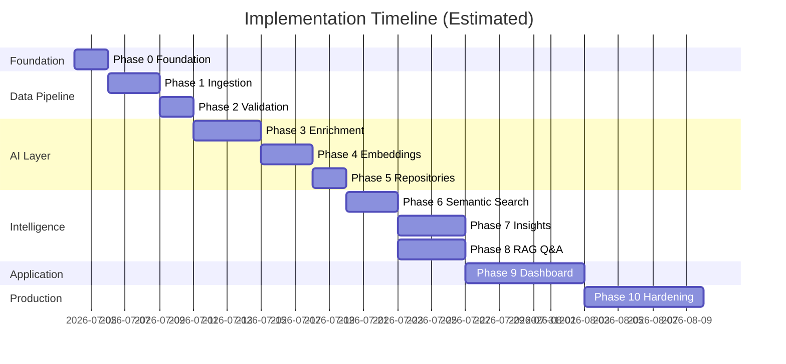

# AI-Powered Review Discovery Engine — Implementation Plan

## Document Purpose

This document is the **execution guide** for building the Review Discovery Engine defined in `ProblemStatement.md` and `Architecture.md`. It translates each architectural phase into concrete tasks, file lists, verification steps, and ordering constraints.

**How to use this plan:**
1. Complete phases in order unless explicitly marked as parallelizable.
2. Finish all tasks in a phase and pass its verification checklist before starting the next phase.
3. Implement **one module at a time** — do not combine unrelated features in a single step.
4. Mark phase checkboxes as complete only when exit criteria are met.

---

## Delivery Tracks

| Track | Phases | Goal | Target |
|-------|--------|------|--------|
| **MVP** | 0 → 2 → 4 → 5 → 6 → 8 → 9 (subset) | Demo-ready research assistant with CSV data | First milestone |
| **MVP (optional)** | Phase 3 enrichment | Structured metadata (sentiment, topics, pain points) | Run when API quota allows |
| **Full Product** | MVP + 3 + 7 + 9 (complete) + 10 | All insights, all sources, production-ready | Second milestone |

MVP intentionally defers: Reddit/App Store adapters, **bulk enrichment** (Phase 3 is implemented but optional at runtime), advanced insight clustering, full dashboard pages, and production hardening.

---

## Prerequisites

Before Phase 0, ensure the following are available:

| Requirement | Details |
|-------------|---------|
| Python | 3.11+ installed |
| Node.js | 18+ (for frontend, Phase 9) |
| Docker Desktop | For PostgreSQL, Redis, local services |
| Google AI Studio API key | [aistudio.google.com](https://aistudio.google.com/) → `GOOGLE_API_KEY` |
| Git | Version control initialized |
| Sample dataset | CSV of Spotify reviews (≥500 rows) for testing |

---

## Development Conventions

Apply these rules across every phase:

- **One module per PR/commit batch** — keep changes reviewable.
- **Tests with logic** — unit tests for validators, parsers, enrichment schema validation.
- **No secrets in code** — all keys via `.env`; commit `.env.example` only.
- **Immutable raw reviews** — never update `reviews.body` after insert.
- **Gemini via single client** — all AI calls go through `src/ai/gemini_client.py`.
- **Log job IDs** — ingestion, enrichment, and embedding jobs must be traceable.

---

## Phase 0 — Foundation & Infrastructure

**Goal:** Runnable project skeleton with database, config, and health check.  
**Depends on:** Nothing  
**Estimated effort:** 1–2 days

### Tasks

#### 0.1 — Initialize repository structure
- [ ] Create folder tree per `Architecture.md` (config, src, tests, scripts, frontend placeholder)
- [ ] Add `.gitignore` (Python, Node, `.env`, `__pycache__`, `.venv`)
- [ ] Add `README.md` with setup instructions stub

**Files created:**
```
.gitignore
README.md
config/__init__.py
config/settings.py
config/sources.yaml
src/__init__.py
src/api/__init__.py
src/api/main.py
src/api/dependencies.py
src/storage/__init__.py
src/storage/database.py
src/storage/models/__init__.py
src/storage/models/review.py
src/storage/models/enrichment.py
tests/__init__.py
tests/conftest.py
scripts/.gitkeep
```

#### 0.2 — Configuration system
- [ ] Implement `Settings` class with Pydantic Settings (`config/settings.py`)
- [ ] Load: `DATABASE_URL`, `REDIS_URL`, `GOOGLE_API_KEY`, Gemini model names, `VECTOR_DIMENSION=768`
- [ ] Create `.env.example` with all variables documented
- [ ] Copy to `.env` locally and fill in values

#### 0.3 — Dependencies
- [ ] Create `requirements.txt`:

```
fastapi>=0.110.0
uvicorn[standard]>=0.27.0
sqlalchemy>=2.0.0
alembic>=1.13.0
psycopg2-binary>=2.9.9
pgvector>=0.2.5
pydantic>=2.0.0
pydantic-settings>=2.0.0
google-genai>=1.0.0
celery>=5.3.0
redis>=5.0.0
python-dotenv>=1.0.0
httpx>=0.27.0
pytest>=8.0.0
pytest-asyncio>=0.23.0
```

- [ ] Create virtual environment and install dependencies

#### 0.4 — Docker Compose
- [ ] Create `docker-compose.yml` with:
  - **postgres** — `pgvector/pgvector:pg16`, port 5432, volume for data
  - **redis** — port 6379
  - **api** (optional in Phase 0) — mount source, expose 8000
- [ ] Enable pgvector extension on first connect

#### 0.5 — Database models & migrations
- [ ] Define SQLAlchemy models:
  - `Review` — all fields from unified schema
  - `ReviewEnrichment` — FK to review, all enrichment fields
  - `IngestionError` — rejected record log (prepare for Phase 2)
- [ ] Initialize Alembic: `alembic init alembic`
- [ ] Create initial migration and apply: `alembic upgrade head`

#### 0.6 — FastAPI application stub
- [ ] `GET /health` → `{ "status": "ok", "db": "connected" }`
- [ ] Wire database session dependency
- [ ] Add structured logging (JSON or standard format with timestamps)
- [ ] Global exception handler returning consistent error JSON

#### 0.7 — Verify Phase 0
```bash
docker compose up -d postgres redis
alembic upgrade head
uvicorn src.api.main:app --reload --port 8000
curl http://localhost:8000/health
pytest tests/ -v
```

### Phase 0 Exit Checklist
- [ ] Docker services start without errors
- [ ] `/health` returns 200 with DB connected
- [ ] Migrations apply on empty database
- [ ] Settings load from `.env` without hardcoded secrets

---

## Phase 1 — Data Ingestion Framework

**Goal:** CSV and JSON reviews persist to `reviews` table via pluggable adapters.  
**Depends on:** Phase 0  
**Estimated effort:** 2–3 days

### Tasks

#### 1.1 — SourceAdapter interface
- [ ] Create `src/ingestion/base.py` with ABC:
  - `source_name: str`
  - `fetch(options) -> Iterable[dict]`
  - `parse(raw: dict) -> ReviewCreate`
  - `validate_raw(raw: dict) -> bool`
- [ ] Define `ReviewCreate` Pydantic model matching unified schema (pre-persist)

#### 1.2 — Adapter registry
- [ ] `src/ingestion/registry.py` — register/get adapter by name
- [ ] Decorator or explicit registration: `@register_adapter("csv")`

#### 1.3 — CSV adapter (MVP priority)
- [ ] `src/ingestion/adapters/csv_adapter.py`
- [ ] Support configurable column mapping via `sources.yaml`:
  ```yaml
  csv:
    column_map:
      body: review_text
      rating: stars
      review_date: date
  ```
- [ ] Generate `content_hash` (SHA-256 of normalized body)
- [ ] Generate UUID for `id`; use row index or hash for `source_id` if missing

#### 1.4 — JSON adapter
- [ ] `src/ingestion/adapters/json_adapter.py`
- [ ] Accept array of review objects or NDJSON
- [ ] Same field mapping logic as CSV

#### 1.5 — Ingestion service
- [ ] `src/ingestion/service.py`:
  - `IngestionService.run(source_name, options) -> IngestionResult`
  - Upsert on `(source, source_id)` — skip duplicates at DB level
  - Return counts: inserted, skipped, failed

#### 1.6 — CLI entry point
- [ ] `scripts/run_pipeline.py`:
  ```bash
  python scripts/run_pipeline.py ingest --source csv --file data/reviews.csv
  python scripts/run_pipeline.py ingest --source json --file data/reviews.json
  ```

#### 1.7 — Sample data
- [ ] Add `data/sample_reviews.csv` (or document where to place it)
- [ ] `scripts/seed_sample_data.py` — convenience wrapper

#### 1.8 — Unit tests
- [ ] Test CSV parsing with valid/invalid rows
- [ ] Test idempotent re-ingestion (second run = 0 inserts)
- [ ] Test registry resolves correct adapter

### Phase 1 Exit Checklist
- [ ] 500+ reviews ingested from CSV into `reviews` table
- [ ] JSON bulk import works
- [ ] Re-running ingest does not create duplicates
- [ ] New adapter requires only: new file + registry entry

### Deferred to Phase 10
- App Store, Google Play, Reddit adapters
- Raw payload object store archival

---

## Phase 2 — Validation, Cleaning, Normalization & Deduplication

**Goal:** All ingested reviews pass through a reliable preprocessing pipeline.  
**Depends on:** Phase 1  
**Estimated effort:** 2 days

### Tasks

#### 2.1 — Validator (`src/pipeline/validator.py`)
- [ ] Required: `body` (min 10 chars), `source`, `review_date` parseable
- [ ] Optional bounds: `rating` 1–5
- [ ] Return `ValidationResult(valid: bool, errors: list[str])`

#### 2.2 — Cleaner (`src/pipeline/cleaner.py`)
- [ ] Strip HTML tags
- [ ] Normalize whitespace, unicode
- [ ] Flag spam patterns (all caps, repeated chars, URL-only)
- [ ] Return cleaned copy — do not mutate input dict in place

#### 2.3 — Normalizer (`src/pipeline/normalizer.py`)
- [ ] Map source-specific fields → canonical schema
- [ ] Language detection (default `en`; use `langdetect` or Gemini later)
- [ ] Standardize dates to UTC ISO-8601
- [ ] Pseudonymize author → `author_hash` (SHA-256 of author string)

#### 2.4 — Deduplicator (`src/pipeline/deduplicator.py`)
- [ ] Primary: `content_hash` exact match → skip
- [ ] Secondary (optional): fuzzy match on body (>90% similarity) → mark as near-duplicate
- [ ] Check against DB before insert

#### 2.5 — Pipeline orchestrator (`src/pipeline/orchestrator.py`)
- [ ] Chain: `validate → clean → normalize → deduplicate → persist`
- [ ] Integrate into `IngestionService` (post-parse, pre-save)
- [ ] Log failures to `ingestion_errors` table with reason code

#### 2.6 — Update CLI
- [ ] Add `--skip-validation` flag for debugging only
- [ ] Print pipeline stats: accepted, rejected, duplicates

#### 2.7 — Unit tests
- [ ] Empty body → rejected
- [ ] Duplicate hash → skipped
- [ ] HTML in body → cleaned, original archived unchanged in logic
- [ ] Malformed date → rejected with reason

### Phase 2 Exit Checklist
- [ ] 1,000+ reviews processed in one batch without manual fixes
- [ ] Rejected records visible in `ingestion_errors` with reasons
- [ ] Zero duplicate `content_hash` rows in `reviews`
- [ ] Pipeline integrated into ingest CLI path

---

## Phase 3 — AI Enrichment Layer

**Goal:** Every valid review gets structured Gemini-generated metadata in `review_enrichments`.  
**Depends on:** Phase 2  
**Estimated effort:** 3–4 days

### Tasks

#### 3.1 — Gemini client (`src/ai/gemini_client.py`)
- [ ] Initialize `google.genai.Client` with `GOOGLE_API_KEY`
- [ ] `generate_json(prompt, schema, model)` — JSON mode + parse
- [ ] `embed(text, model)` — returns 768-dim vector
- [ ] Retry with exponential backoff on rate limit / 503
- [ ] Token/cost logging per call

#### 3.2 — Enrichment schemas (`src/enrichment/schemas.py`)
- [ ] Pydantic model `EnrichmentOutput` with all fields from architecture
- [ ] Enums: `Sentiment`, optional constrained lists for topics/segments

#### 3.3 — Prompt template (`src/enrichment/prompts/enrichment_v1.txt`)
- [ ] System instructions: extract structured fields, return JSON only
- [ ] Include review body, rating, source as context
- [ ] Version string: `enrichment-v1`

#### 3.4 — Enricher service (`src/enrichment/enricher.py`)
- [ ] `enrich(review) -> ReviewEnrichment`
- [ ] `enrich_batch(reviews, concurrency=5) -> list[ReviewEnrichment]`
- [ ] Skip if enrichment exists for same `model_version`
- [ ] Never write to `reviews.body`

#### 3.5 — Celery worker setup
- [ ] `src/workers/tasks.py` — `enrich_reviews_task(review_ids: list[str])`
- [ ] `src/workers/celery_app.py` — Celery config with Redis broker
- [ ] Chain: after ingest completes → enqueue enrichment for new review IDs

#### 3.6 — CLI commands
```bash
python scripts/run_pipeline.py enrich --limit 100
python scripts/run_pipeline.py enrich --all
```

#### 3.7 — Unit & integration tests
- [ ] Mock Gemini client — validate schema parsing
- [ ] Test skip logic for already-enriched reviews
- [ ] Integration test with 5 real reviews (marked `@pytest.mark.integration`)

### Phase 3 Exit Checklist
- [ ] ≥95% of sample reviews produce valid enrichment JSON
- [ ] `reviews.body` unchanged after enrichment
- [ ] Re-run with new `model_version` creates new enrichment rows
- [ ] Celery worker processes batch asynchronously
- [ ] Failed enrichments logged with review_id and error

---

## Phase 4 — Embedding Generation & Vector Storage

**Goal:** Review text embedded and stored in pgvector for semantic search.  
**Depends on:** Phase 3  
**Estimated effort:** 2–3 days  
**Parallelizable with:** Phase 5 (after 4.1–4.3 complete)

### Tasks

#### 4.1 — Database: embeddings table
- [ ] Alembic migration: `review_embeddings`
  - `id`, `review_id` (FK), `chunk_index`, `embedding` (vector(768)), `content_hash`, `model_version`, `created_at`
- [ ] Create HNSW or IVFFlat index on `embedding`

#### 4.2 — Chunker (`src/embeddings/chunker.py`)
- [ ] Split reviews >512 tokens into chunks (overlap 50 tokens)
- [ ] Return list of `(review_id, chunk_index, text)`

#### 4.3 — Embedder (`src/embeddings/embedder.py`)
- [ ] Call `GeminiClient.embed()` with `text-embedding-004`
- [ ] Cache by `content_hash` — skip re-embed if hash exists
- [ ] Batch embed up to API limit

#### 4.4 — Vector store (`src/storage/vector_store.py`)
- [ ] `upsert_embeddings(records)`
- [ ] `similarity_search(query_vector, top_k, filters) -> list[ScoredResult]`
- [ ] Filter by review metadata via JOIN to `reviews` / `review_enrichments`

#### 4.5 — Celery task
- [ ] `embed_reviews_task(review_ids)` — chained after enrichment
- [ ] Progress: log every N reviews

#### 4.6 — CLI
```bash
python scripts/run_pipeline.py embed --limit 500
python scripts/run_pipeline.py embed --all
```

#### 4.7 — Smoke test
- [ ] Embed 100 reviews
- [ ] Manual query: "repetitive recommendations" returns reviews mentioning "same songs"

### Phase 4 Exit Checklist
- [ ] Embeddings stored with correct dimension (768)
- [ ] Embedding job resumable (skips existing content_hash)
- [ ] Vector index created and query returns results <500ms on 1K vectors
- [ ] `model_version` tracked per embedding row

---

## Phase 5 — Metadata Storage & Repository Layer

**Goal:** Clean data-access API for all upper layers.  
**Depends on:** Phases 0–4  
**Estimated effort:** 2 days

### Tasks

#### 5.1 — ReviewRepository (`src/storage/repositories/review_repo.py`)
- [ ] `get_by_id(id)`, `list(filters, pagination, sort)`
- [ ] Filters: source, platform, date_range, rating, language

#### 5.2 — EnrichmentRepository (`src/storage/repositories/enrichment_repo.py`)
- [ ] `get_by_review_id(id)`
- [ ] `list_by_topic(topic)`, `list_by_pain_point(pain_point)`
- [ ] `aggregate_sentiment_by_segment()`

#### 5.3 — EmbeddingRepository (`src/storage/repositories/embedding_repo.py`)
- [ ] Thin wrapper over `VectorStore` with repository interface
- [ ] `find_similar(query_vector, top_k, filters)`

#### 5.4 — Composite queries
- [ ] `get_review_with_enrichment(id) -> ReviewDetail`
- [ ] `search_reviews_with_enrichment(filters) -> list[ReviewDetail]`

#### 5.5 — Full-text search prep
- [ ] Add `tsvector` column on `reviews.body` (migration)
- [ ] GIN index for keyword fallback

#### 5.6 — Database indexes
- [ ] Index: `reviews(source, review_date)`, `reviews(content_hash)`
- [ ] Index: `review_enrichments(primary_topic, pain_point, user_segment, sentiment)`

#### 5.7 — Unit tests
- [ ] Repository methods with test DB fixtures
- [ ] Pagination returns correct counts

### Phase 5 Exit Checklist
- [ ] All filter combinations used by dashboard have repository methods
- [ ] No raw SQL in services outside repository layer
- [ ] Filtered query <200ms on 50K rows (or documented baseline on sample size)

---

## Phase 6 — Semantic Search & Retrieval

**Goal:** Natural-language search API returning ranked, evidence-rich results.  
**Depends on:** Phase 5  
**Estimated effort:** 2–3 days

### Tasks

#### 6.1 — Search models
- [ ] `SearchQuery` — query text, filters, top_k
- [ ] `SearchResult` — review, enrichment, score, excerpt, highlight_offsets

#### 6.2 — SemanticSearchService (`src/retrieval/semantic_search.py`)
- [ ] Embed query via GeminiClient
- [ ] Vector search via EmbeddingRepository
- [ ] Apply metadata pre-filters
- [ ] Extract best matching excerpt (sentence with highest term overlap or first 200 chars)

#### 6.3 — Ranker (`src/retrieval/ranker.py`) — optional v1
- [ ] Hybrid score: `0.7 * vector_score + 0.3 * keyword_score`
- [ ] Re-rank top 20 candidates

#### 6.4 — API route (`src/api/routes/search.py`)
- [ ] `POST /api/v1/search`
- [ ] Request body: `{ "query": "...", "filters": {}, "top_k": 10 }`
- [ ] Register router in `main.py`

#### 6.5 — Tests
- [ ] Paraphrase test: "same songs every day" matches "repetitive playlist"
- [ ] Filter test: source=reddit narrows results
- [ ] Empty query → 400; no results → empty array with 200

### Phase 6 Exit Checklist
- [ ] Search API returns results with review_id, excerpt, score, source
- [ ] Semantic search outperforms keyword-only on paraphrase test set (≥5 test queries)
- [ ] Filters work without breaking relevance order

---

## Phase 7 — Insight Generation

**Goal:** Automated, evidence-backed aggregate insights.  
**Depends on:** Phases 3, 5, 6  
**Estimated effort:** 3–4 days  
**Parallelizable with:** Phase 8

### Tasks

#### 7.1 — Insight models
- [ ] `Insight` — type, title, summary, evidence_review_ids, metrics, generated_at
- [ ] Alembic migration: `insights_cache` table

#### 7.2 — Aggregator (`src/insights/aggregator.py`)
- [ ] Top pain points — GROUP BY `pain_point`, count, sample reviews
- [ ] Top feature requests — GROUP BY `feature_request`
- [ ] Platform comparison — GROUP BY source + sentiment

#### 7.3 — Trend analyzer (`src/insights/trend_analyzer.py`)
- [ ] Weekly/monthly rollups on topic and sentiment
- [ ] Period-over-period delta (% change)

#### 7.4 — Theme detector (`src/insights/theme_detector.py`)
- [ ] Cluster similar pain_points (embedding similarity or Gemini batch synthesis)
- [ ] JTBD synthesis: Gemini summarizes cluster into job statement

#### 7.5 — InsightService (`src/insights/service.py`)
- [ ] `generate(insight_type, params) -> Insight`
- [ ] `refresh_cache()` — recompute all standard insights
- [ ] Celery scheduled task (optional): nightly refresh

#### 7.6 — API routes (`src/api/routes/insights.py`)
- [ ] `GET /api/v1/insights` — list cached insights
- [ ] `GET /api/v1/insights/{type}` — pain_points | feature_requests | trends | segments

#### 7.7 — Tests
- [ ] Each insight type returns ≥3 evidence review IDs
- [ ] Regenerate does not duplicate cache entries

### Phase 7 Exit Checklist
- [ ] Top 10 pain points and feature requests generated with evidence
- [ ] Trend insight shows time-period comparison
- [ ] Insights API consumable by frontend
- [ ] MVP note: basic aggregations sufficient; advanced clustering can wait

---

## Phase 8 — RAG-Based Natural Language Q&A

**Goal:** Research questions answered with Gemini-generated, citation-backed responses.  
**Depends on:** Phases 6, 7 (7 optional for MVP — search-only context works)  
**Estimated effort:** 3–4 days  
**Parallelizable with:** Phase 7

### Tasks

#### 8.1 — RAG models
- [ ] `AskRequest` — question, filters, top_k
- [ ] `AskResponse` — answer, confidence, citations, related_insights, retrieval_count

#### 8.2 — Retriever (`src/rag/retriever.py`)
- [ ] Retrieve top-K via SemanticSearchService
- [ ] Optional: query rewrite via `gemini-2.0-flash`

#### 8.3 — Prompt builder (`src/rag/prompt_builder.py`)
- [ ] Assemble context block: review excerpts + enrichment summaries
- [ ] Include insight snippets if available
- [ ] Instructions: cite review IDs, refuse if insufficient evidence

#### 8.4 — Answer generator (`src/rag/answer_generator.py`)
- [ ] Call `gemini-2.5-pro` with assembled prompt
- [ ] Parse structured response (answer + citation list)
- [ ] Citation validation: every cited review_id must be in retrieved set

#### 8.5 — Guardrails
- [ ] If top result score < threshold → return "insufficient evidence"
- [ ] If retrieval_count == 0 → do not call LLM

#### 8.6 — API route (`src/api/routes/ask.py`)
- [ ] `POST /api/v1/ask`
- [ ] Request: `{ "question": "Why do users struggle to discover new music?" }`

#### 8.7 — Test with problem-statement questions
- [ ] "Why do users struggle to discover new music?"
- [ ] "What frustrations exist with recommendations?"
- [ ] "Which product features are most frequently requested?"
- [ ] Verify each answer has ≥1 citation with valid review_id

### Phase 8 Exit Checklist
- [ ] All sample questions produce cited answers or explicit "insufficient evidence"
- [ ] Citations match stored review text (excerpt ⊆ body)
- [ ] No hallucinated review IDs
- [ ] Response latency documented (target <15s for top_k=15)

---

## Phase 9 — Research Dashboard & API Surface

**Goal:** Full user-facing application for research workflows.  
**Depends on:** Phases 6, 7, 8  
**Estimated effort:** 5–7 days

### Tasks

#### 9.1 — Complete remaining API routes
- [ ] `GET /api/v1/reviews/{id}` — review + enrichment
- [ ] `GET /api/v1/topics` — topic clusters
- [ ] `GET /api/v1/segments` — segment breakdown
- [ ] `POST /api/v1/export` — CSV/JSON download
- [ ] `POST /api/v1/ingest` — trigger ingest job (admin)
- [ ] CORS config for frontend origin

#### 9.2 — Frontend scaffold
- [ ] `npm create vite@latest frontend -- --template react-ts`
- [ ] Install Tailwind CSS, React Router, TanStack Query (or SWR)
- [ ] `frontend/src/services/api.ts` — typed API client

#### 9.3 — MVP pages (build first)
- [ ] **Search** — query input, filter sidebar, result cards with excerpts
- [ ] **Ask** — chat UI, markdown answer, citation cards linking to review detail
- [ ] **Review Detail** — full review, enrichment fields, source link

#### 9.4 — Full dashboard pages (after MVP)
- [ ] **Insights** — pain points, feature requests, trend charts
- [ ] **Topics** — cluster list → drill-down
- [ ] **Segments** — comparison table/chart
- [ ] **Export** — select insights/reviews → download

#### 9.5 — Shared components
- [ ] `EvidencePanel.tsx` — list of supporting reviews
- [ ] `CitationCard.tsx` — excerpt, source, date, relevance score
- [ ] `FilterBar.tsx` — source, date, sentiment, segment
- [ ] Layout: sidebar nav, header, content area

#### 9.6 — End-to-end wiring
- [ ] Docker Compose: add frontend service or document `npm run dev`
- [ ] Environment: `VITE_API_URL=http://localhost:8000`

#### 9.7 — E2E demo script
Document in README:
1. Start services
2. Ingest sample CSV
3. Run enrich + embed
4. Open dashboard → search → ask → view citation → export

### Phase 9 Exit Checklist
- [ ] MVP flow works: ingest → search → ask → review detail
- [ ] Every insight/citation clickable to source evidence
- [ ] Export produces valid CSV/JSON
- [ ] UI usable on desktop (1280px+)
- [ ] No direct API calls required for demo workflow

---

## Phase 10 — Production Hardening, Observability & Scale

**Goal:** Reliable system ready for 100K+ reviews and additional data sources.  
**Depends on:** Phase 9  
**Estimated effort:** 5–7 days

### Tasks

#### 10.1 — Observability
- [ ] Structured JSON logging across API and workers
- [ ] Request ID middleware (correlate API → worker logs)
- [ ] Metrics: enrichment success rate, embed latency, search latency, Gemini token usage
- [ ] Health checks: DB, Redis, Celery worker, Gemini connectivity

#### 10.2 — Error handling & resilience
- [ ] Dead-letter queue for failed enrichment/embed jobs
- [ ] Exponential backoff retries (max 3)
- [ ] Admin endpoint: `GET /api/v1/jobs/{id}` — job status
- [ ] Idempotent job processing

#### 10.3 — Security
- [ ] API key authentication on write endpoints
- [ ] Rate limiting (e.g., 60 req/min on `/ask`)
- [ ] Input sanitization on search and ask queries
- [ ] Secrets rotation documented

#### 10.4 — Performance
- [ ] Connection pooling tuned for Postgres
- [ ] Vector index optimization (HNSW params)
- [ ] Cache hot insights in Redis (TTL 1 hour)
- [ ] Batch size tuning documented

#### 10.5 — Additional source adapters
- [ ] `src/ingestion/adapters/reddit_adapter.py` — PRAW
- [ ] `src/ingestion/adapters/app_store_adapter.py`
- [ ] `src/ingestion/adapters/google_play_adapter.py`
- [ ] Raw payload archival to local/S3 object store

#### 10.6 — CI/CD
- [ ] GitHub Actions: lint (ruff), type check (mypy optional), pytest
- [ ] Integration test job with Postgres service container
- [ ] Docker image build for API + worker

#### 10.7 — Documentation
- [ ] OpenAPI docs auto-generated at `/docs`
- [ ] Runbook: ingest, re-enrich, re-embed, index rebuild
- [ ] Scale migration guide: pgvector → Qdrant

### Phase 10 Exit Checklist
- [ ] 100K review ingest tested (or load test plan documented)
- [ ] Failed jobs recoverable via retry/DLQ
- [ ] New source adapter added in <1 day (proven with one new source)
- [ ] CI passes on main branch
- [ ] All success criteria from Architecture.md met

---

## Master Implementation Timeline



**MVP shortcut (~3 weeks):** Phase 0 → 2 → 3 → 4 → 5 → 6 → 8 → 9 (Search + Ask + Review Detail only)

**Full product (~6–7 weeks):** All phases including 7, complete dashboard, and Phase 10.

---

## MVP Implementation Order (Recommended First Build)

Execute strictly in this order for the fastest demo:

| Step | Phase | Action | Verification |
|------|-------|--------|--------------|
| 1 | 0 | Scaffold + DB + health | `curl /health` |
| 2 | 1 | CSV ingest only | 500 rows in DB |
| 3 | 2 | Pipeline integrated | 0 duplicates, errors logged |
| 4 | 3 | Gemini enrichment | Enrichments for 500 reviews |
| 5 | 4 | Embeddings in pgvector | Similarity smoke test |
| 6 | 5 | Repositories | Filter queries work |
| 7 | 6 | Search API | Paraphrase query returns hits |
| 8 | 8 | Ask API | Question → cited answer |
| 9 | 9 | Minimal UI | Browser demo end-to-end |

Skip until post-MVP: Phase 7 (insights UI), Reddit/App Store adapters, Phase 10.

---

## Testing Strategy

| Layer | Type | When |
|-------|------|------|
| Validators, parsers, normalizers | Unit | Each Phase 1–2 task |
| Enrichment schema parsing | Unit (mocked Gemini) | Phase 3 |
| Gemini integration | Integration (5 reviews) | Phase 3 — manual/API key |
| Vector search | Integration | Phase 4–6 |
| Search paraphrase set | Regression suite | Phase 6 — maintain 5+ queries |
| RAG citation validation | Unit + integration | Phase 8 |
| API routes | Integration (TestClient) | Phases 6–9 |
| E2E demo path | Manual checklist | Phase 9 |

```bash
# Run unit tests only
pytest tests/unit -v

# Run integration tests (requires .env + DB)
pytest tests/integration -v -m integration
```

---

## Risk Register

| Risk | Impact | Mitigation |
|------|--------|------------|
| Gemini rate limits during bulk enrichment | Pipeline stalls | Batch concurrency config; exponential backoff; process in off-peak batches |
| Enrichment JSON parse failures | Missing metadata | Strict Pydantic validation; retry with simplified prompt; log failures |
| pgvector performance at scale | Slow search | HNSW index; migrate to Qdrant per Phase 10 guide |
| Poor RAG citations | Untrustworthy answers | Citation validation; confidence threshold; "insufficient evidence" fallback |
| CSV schema variance | Ingest failures | Configurable column mapping in `sources.yaml` |
| Scope creep | Delayed MVP | Follow MVP track; defer Phase 7 UI and external adapters |

---

## Definition of Done (Project Complete)

The implementation is complete when all items below are true:

- [ ] Phases 0–10 exit checklists passed
- [ ] MVP demo runs: CSV ingest → enrich → embed → search → ask → export
- [ ] Architecture success criteria (from `Architecture.md`) all checked
- [ ] `README.md` documents setup, env vars, CLI commands, and demo steps
- [ ] No secrets committed; `.env.example` is current
- [ ] At least three source types supported (CSV + JSON + one live source)

---

## Immediate Next Action

**Start Phase 0, Task 0.1:** Initialize the repository folder structure and configuration files.

Before writing code, confirm:
1. FastAPI + PostgreSQL/pgvector + React + Google Gemini (`google-genai`) — approved
2. Sample CSV dataset is available or will be created
3. `GOOGLE_API_KEY` is obtained from Google AI Studio

Once confirmed, implement Phase 0 tasks in order and verify with the Phase 0 exit checklist.
